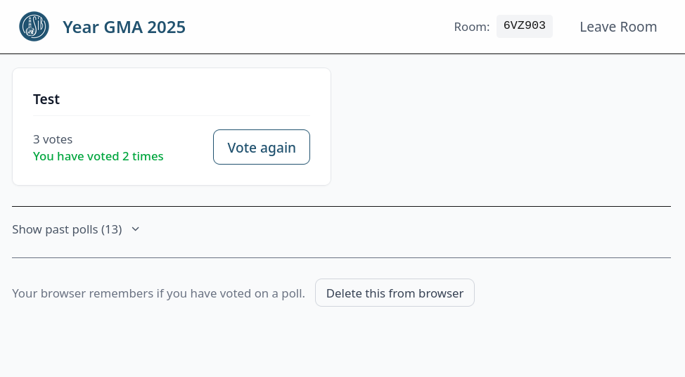
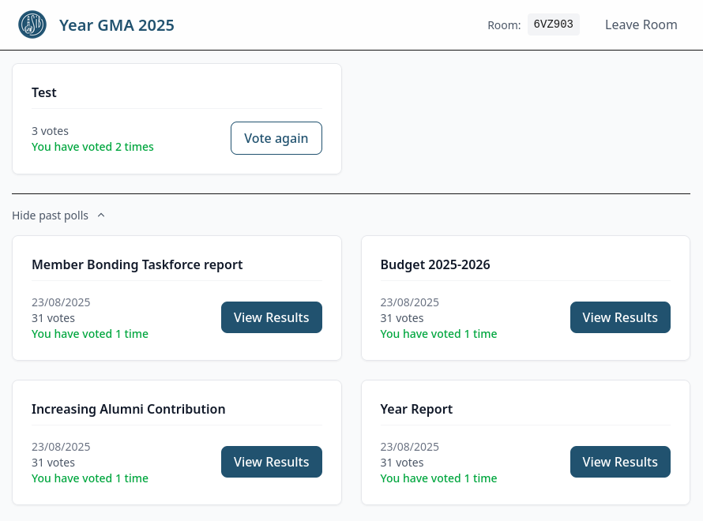
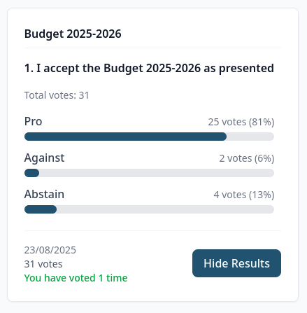
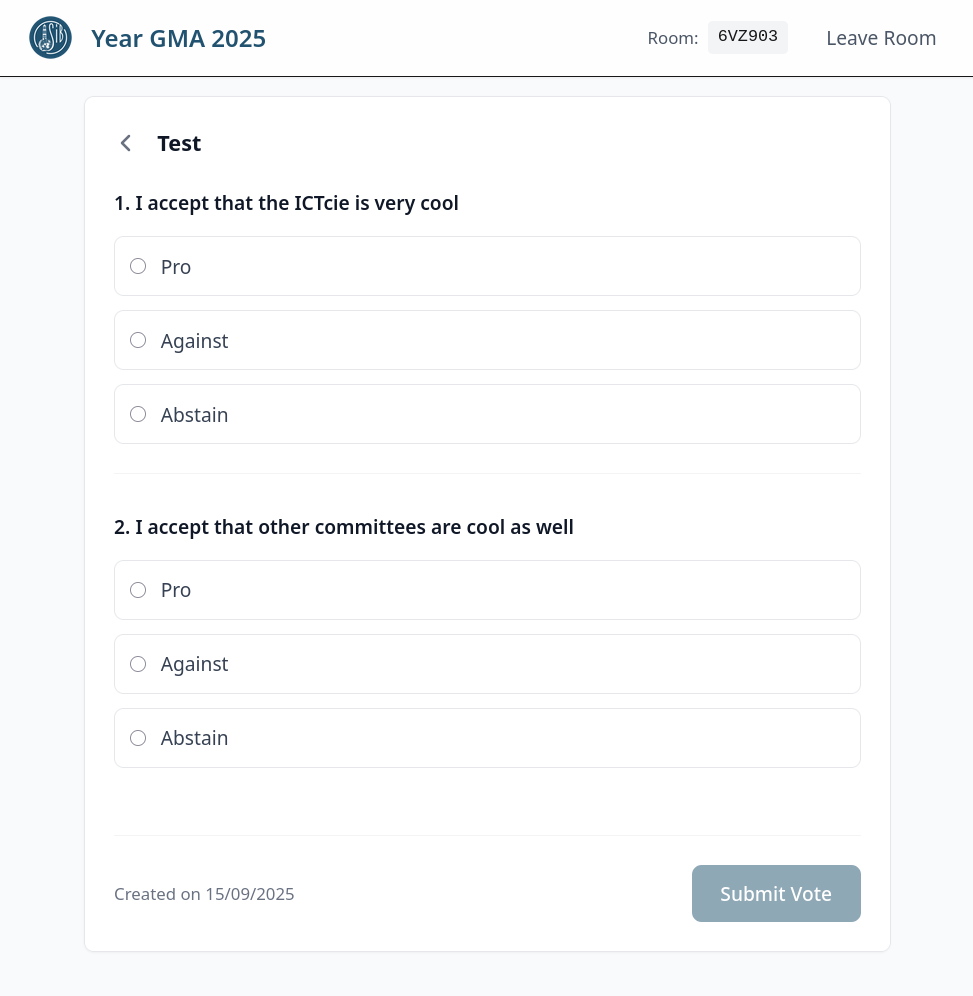
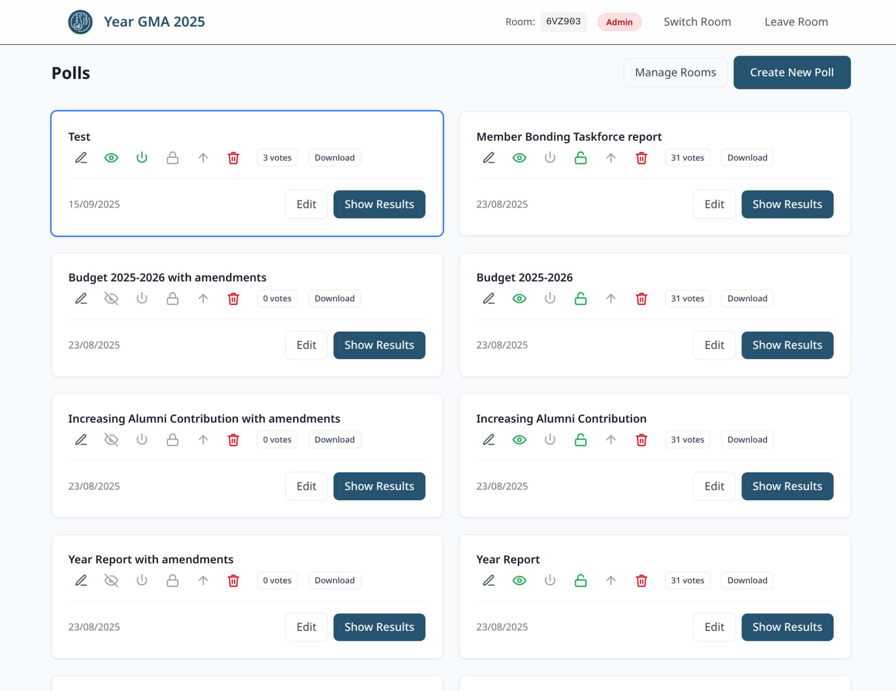
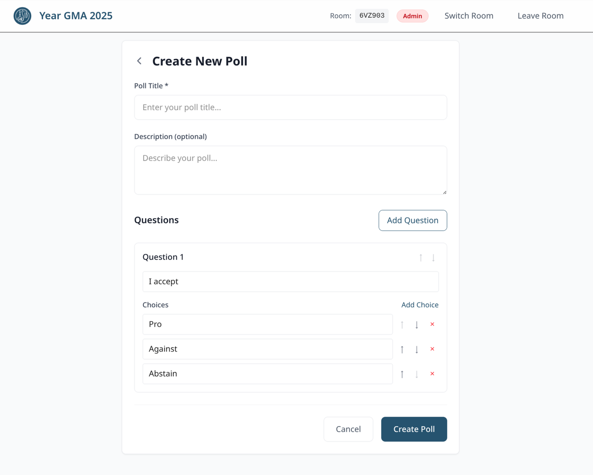
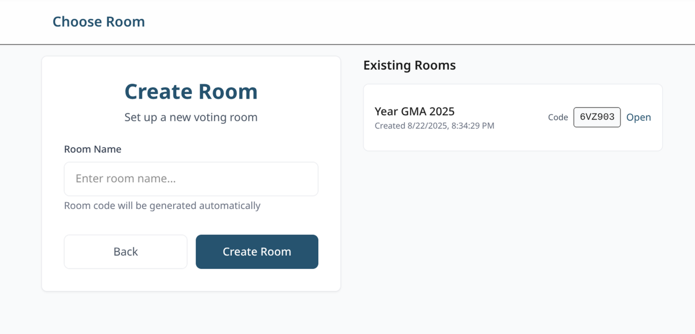

# SIB-Utrecht Voting Website (vote.sib-utrecht.nl)

> [!NOTE]  
> The website is live at [vote.sib-utrecht.nl](https://vote.sib-utrecht.nl)!
> The room code is shown at the GMA or autofilled from a link you click. The
> example images below show a real room, but with a non-existent room code.

At SIB-Utrecht we hold General Member Assemblies where members can vote. While
this seems simple, we found no existing solution that:

1. Is completely anonymous, with zero tracking of users. Or at the very least,
   GDPR compliant.
2. Is free or almost free.
3. Allows members to vote a second time if they are authorised.
4. Indicates if you have already voted on a poll.
5. Allows for anonymous authentication using a room code.
6. Provides real-time vote counts.
7. Allows polls to be easily opened and closed, and shows this in real-time to
   the user.

In the past, we used a setup of Linktree and CognitoForms to accomplish voting.
They satisfied requirements 1-3, but none of the other. Most frustratingly,
votes had to be manually counted (there was no '10 votes for answer Against').
We had to put links to CognitoForms polls in a Linktree, and people had to
refresh manually. It regularly occurred that someone forgot to refresh, causing
them to vote on an old poll instead. In summary, this setup was difficult for
everyone, and very error prone.

After struggling with this system for years, the secretary of the board
2024-2025 (and author of this text, Vincent Kuhlmann), decided to
make a new system. It got built on top of modern technology, like Convex, Vite,
Tailwind, TypeScript and React. This way, in just 3 days of work, with great
help from Generative AI, the new website was built. Several days later, it was
first used in production, at the Year GMA of 25 August 2025.

## User side

The user side page is very simple: you get a list of active polls, and you can
vote on them.

<picture>
  
</picture>

You can also see a list of previous polls

<picture>
  
</picture>

If the admin has enabled showing results for a poll, you can click
'View Results' to view them. A poll is a set of one or more questions, with
simple choice answers.

<picture>
  
</picture>
<picture>
  
</picture>

## Admin side

If logged in as an admin, you can manage polls and create new rooms.

<picture>
  
</picture>

<picture>
  
</picture>

<picture>
  
</picture>

## Tech stack

This is a project using [Vite](https://vitejs.dev/),
[Tailwind](https://tailwindcss.com/), React, TypeScript and
[Convex](https://convex.dev). It was originally created using
[Chef](https://chef.convex.dev), and then further developed in Cursor and
VS Code, with help from GitHub Copilot.

We use a self-hosted instance of Convex for production.

## License

The project is available under Apache 2.0 license, see [LICENSE](./LICENSE).
**This excludes** the files `convex_rules.mdc` and `copilot-instructions.md`;
they are property of Convex, and may be licensed differently.

## Running locally

1. Clone the repository.
2. Create a `.env.local` file with the contents from `.env.template`, but with
   the environment variables configured correctly.
3. Run `npm run dev` to start the web server.
4. Open the localhost page in your browser.

